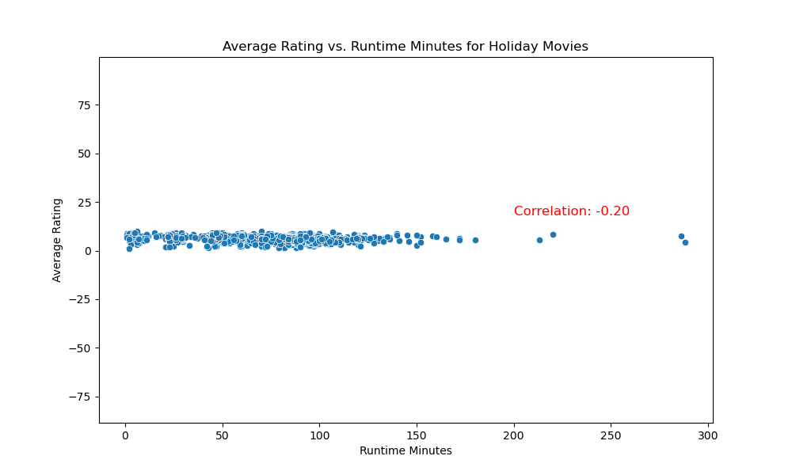
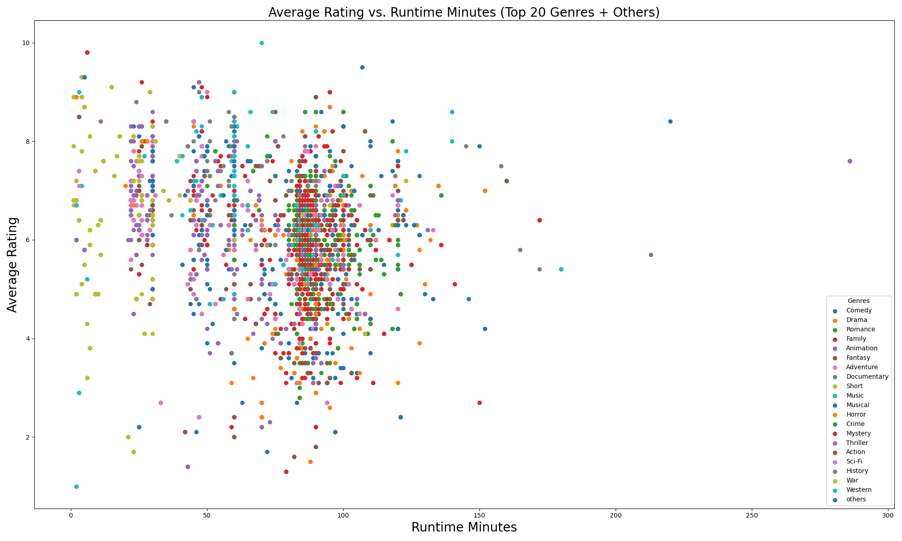
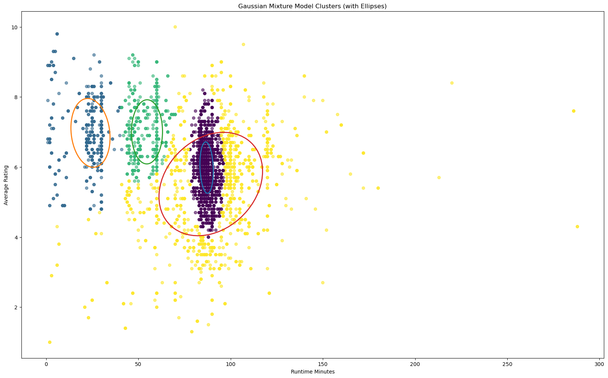
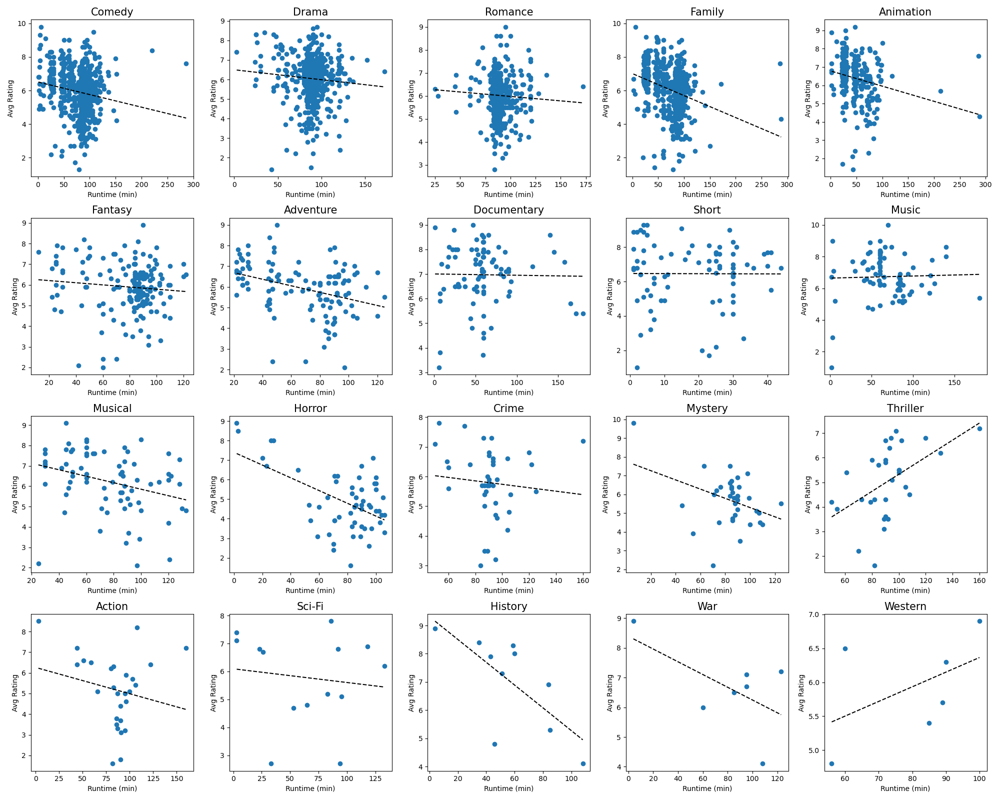
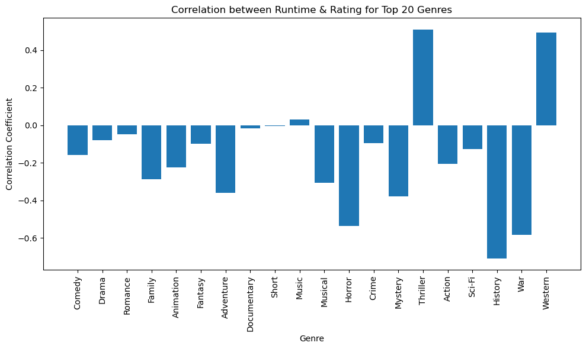

# Holiday Movies Analysis

## Introduction
This project aims to explore and uncover insights about holiday-themed movies using the [TidyTuesday 2023-12-12 Holiday Movies](https://github.com/rfordatascience/tidytuesday/blob/main/data/2023/2023-12-12/readme.md) release. It includes information from the Internet Movie Database (IMDb) and specifically focuses on films with titles containing keywords such as "holiday", "Christmas", "Hanukkah", or "Kwanzaa", as well as their variants.

This data set is significant because holiday films are a unique genre that generally reflects cultural trends, seasonal demand by audiences, and production trends. Through the analysis of this data set, we could observe holiday films' evolution over time in their genre, quality (measured through ratings), and production numbers. However, there are certain issues with the data set. For instance, it only includes movies with specified keywords in their titles, potentially leaving out some suitable films. Furthermore, user-generated IMDb ratings can be prone to bias and at times fail to reflect the overall value of the film. With these limitations in mind, the dataset does offer an opportunity to study holiday movie trends and trends.

### Data Dictionary

`holiday_movies.csv`

|variable        |class     |description     |
|:---------------|:---------|:---------------|
|tconst          |character |alphanumeric unique identifier of the title |
|title_type      |character |the type/format of the title (movie, video, or tvMovie) |
|primary_title   |character |the more popular title / the title used by the filmmakers on promotional materials at the point of release |
|original_title  |character |original title, in the original language |
|year            |double    |the release year of a title |
|runtime_minutes |double    |primary runtime of the title, in minutes |
|genres          |character |includes up to three genres associated with the title (comma-delimited) |
|simple_title    |character |the title in lowercase, with punctuation removed, for easier filtering and grouping |
|average_rating  |double    |weighted average of all the individual user ratings on IMDb |
|num_votes       |double    |number of votes the title has received on IMDb (titles with fewer than 10 votes were not included in this dataset) |
|christmas       |logical   |whether the title includes "christmas", "xmas", "x mas", etc|
|hanukkah        |logical   |whether the title includes "hanukkah", "chanukah", etc|
|kwanzaa         |logical   |whether the title includes "kwanzaa"|
|holiday         |logical   |whether the title includes the word "holiday"|

## Q1: Do higher-rated movies tend to have longer runtimes?

The first question we will explore is whether higher-rated movies tend to have longer runtimes. To answer this question, we will create a scatter plot of average ratings against runtime minutes in the original holiday movies dataset, and add correlation coefficient between these two variables to quantify the relationship.

However, we can not see the clear relationship here. The correlation coefficient is -0.2, which is relatively close to 0 and can not indicates any relationship between 2 variables.

Hence, we continue by grouping the data by genres and add the label to the plot to see if there is any difference.

However, we still can not see the relationship, and the color somehow made us confused. But, this motivate us to use some other unsupervised methods to gain more information about the underlying relationship between the two variables given different genres.

We use Gaussian Mixture Model (GMM) to cluster the data into some clusters, each has normal distribution, and plot the results. We can see that some center of distribitions are overlap. This explain why the scatter plot by genres is confused and this also indicates that the two variables are not independent, it raise us a hypothesis that we can further evaluate the relationship if accessing each genres separately.

Hence, we create a scatter plot for each genre and add a regression line. Now the relationship is clearer because some lines have non-zero slopes. This indicates that the relationship between average ratings and runtime minutes is not consistent across all genres.

In a more qualitative evaluation, we can use bar plot to show the correlation coefficient for each genre. Clearly, from the chart, we can see that genres such as Thriller and Western show a strong positive correlation, meaning that longer runtime tends to correlate with higher ratings for these genres. In contrast, genres like History and War exhibit a negative correlation, suggesting that longer runtimes in these genres tend to be associated with lower ratings.

Finally, the answer is YES, but restricted to some genres.
