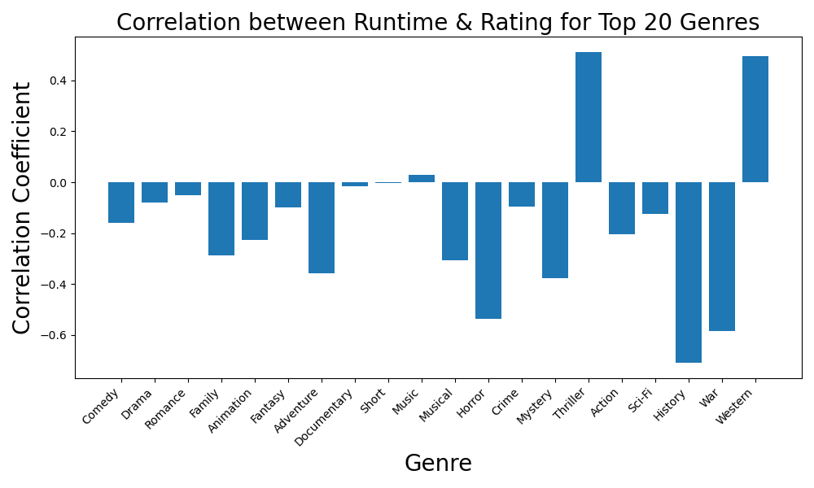

# Holiday Movies Analysis

## Introduction
This project aims to explore and uncover insights about holiday-themed movies using the [TidyTuesday 2023-12-12 Holiday Movies](https://github.com/rfordatascience/tidytuesday/blob/main/data/2023/2023-12-12/readme.md) release. It includes information from the Internet Movie Database (IMDb) and specifically focuses on films with titles containing keywords such as "holiday", "Christmas", "Hanukkah", or "Kwanzaa", as well as their variants.

This data set is significant because holiday films are a unique genre that generally reflects cultural trends, seasonal demand by audiences, and production trends. Through the analysis of this data set, we could observe holiday films' evolution over time in their genre, quality (measured through ratings), and production numbers. However, there are certain issues with the data set. For instance, it only includes movies with specified keywords in their titles, potentially leaving out some suitable films. Furthermore, user-generated IMDb ratings can be prone to bias and at times fail to reflect the overall value of the film. With these limitations in mind, the dataset does offer an opportunity to study holiday movie trends and trends.

### Data Dictionary

`holiday_movies.csv`

|variable        |class     |description     |
|:---------------|:---------|:---------------|
|tconst          |character |alphanumeric unique identifier of the title |
|title_type      |character |the type/format of the title (movie, video, or tvMovie) |
|primary_title   |character |the more popular title / the title used by the filmmakers on promotional materials at the point of release |
|original_title  |character |original title, in the original language |
|year            |double    |the release year of a title |
|runtime_minutes |double    |primary runtime of the title, in minutes |
|genres          |character |includes up to three genres associated with the title (comma-delimited) |
|simple_title    |character |the title in lowercase, with punctuation removed, for easier filtering and grouping |
|average_rating  |double    |weighted average of all the individual user ratings on IMDb |
|num_votes       |double    |number of votes the title has received on IMDb (titles with fewer than 10 votes were not included in this dataset) |
|christmas       |logical   |whether the title includes "christmas", "xmas", "x mas", etc|
|hanukkah        |logical   |whether the title includes "hanukkah", "chanukah", etc|
|kwanzaa         |logical   |whether the title includes "kwanzaa"|
|holiday         |logical   |whether the title includes the word "holiday"|


## Q1: Do higher-rated movies tend to have longer runtimes?

Firstly, we will show how we process the data. Here is the plot for top 20 genres, with overlap.
```python
plt.figure(figsize=(12, 6))
holiday_movies['genres'].value_counts().head(20).plot(kind='barh')
plt.title('Top 20 Genres in Holiday Movies', fontsize=20)
plt.yticks(fontsize=15)
# add value to the right of the bar
for index, value in enumerate(holiday_movies['genres'].value_counts().head(20)):
    plt.text( value, index, str(value), fontsize=10) # move the text down a bit
    
    
plt.xlabel('Count', fontsize=15)

plt.tight_layout()
plt.savefig('top_20_genres.png')
plt.show()
```


The first question we will explore is whether higher-rated movies tend to have longer runtimes. To answer this question, we will create a scatter plot of average ratings against runtime minutes in the original holiday movies dataset, and add correlation coefficient between these two variables to quantify the relationship.

### Code block
```python
correlation = holiday_movies['average_rating'].corr(holiday_movies['runtime_minutes'])
print(f'Correlation between average rating and runtime minutes: {correlation:.2f}')

# Create the scatter plot
plt.figure(figsize=(10, 6))
sns.scatterplot(data=holiday_movies, x='runtime_minutes', y='average_rating')

# Set the title and labels
plt.title('Average Rating vs. Runtime Minutes for Holiday Movies')
plt.xlabel('Runtime Minutes')
plt.ylabel('Average Rating')

# Add correlation text to the plot
plt.text(200, 2*9, f'Correlation: {correlation:.2f}', fontsize=12, color='red')

# Ensure both axes have equal scaling
plt.axis('equal')
plt.savefig("scatter.png")
# Show the plot
plt.show()

```


However, we can not see the clear relationship here. The correlation coefficient is -0.2, which is relatively close to 0 and can not indicates any relationship between 2 variables.

Next, we process my data by splitting each group of genres into seperate genres.

```python
# 1) Split the "genres" column on comma -> list of genres
holiday_movies['genres'] = holiday_movies['genres'].str.split(',')

# 2) Explode the lists into rows
holiday_movies_exploded = holiday_movies.explode('genres')

# 3) Strip any leading/trailing whitespace from each genre
holiday_movies_exploded['genres'] = holiday_movies_exploded['genres'].str.strip()
plt.figure(figsize=(12, 8))
holiday_movies_exploded['genres'].value_counts().head(20).plot(kind='barh')
# add text to the right of the bar
plt.yticks(fontsize=15)
for index, value in enumerate(holiday_movies_exploded['genres'].value_counts().head(20)):
    plt.text( value, index, str(value), fontsize=10) # move the text down a bit
plt.xlabel('Count', fontsize=15)


plt.title('Top 20 Genres in Holiday Movies Exploded',fontsize=20)
plt.tight_layout()
plt.savefig('top_20_genres_exploded.png')
plt.show()
```


Hence, we continue by grouping the data by genres and add the label to the plot to see if there is any difference.

### Code block
```python
# 1) Count how often each genre appears
genre_counts = holiday_movies_exploded['genres'].value_counts()

# 2) Identify the top 20
top_20_genres = genre_counts.head(20).index

plt.figure(figsize=(20, 12))

# 3) Plot each of the top 20 genres separately
for genre in top_20_genres:
    subset = holiday_movies_exploded[holiday_movies_exploded['genres'] == genre]
    plt.scatter(subset['runtime_minutes'], 
                subset['average_rating'], 
                label=genre)

# 4) Group all remaining genres into "others"
others_subset = holiday_movies_exploded[~holiday_movies_exploded['genres'].isin(top_20_genres)]
plt.scatter(others_subset['runtime_minutes'],
            others_subset['average_rating'],
            label='others')

plt.title('Average Rating vs. Runtime Minutes (Top 20 Genres + Others)',fontsize = 20)
plt.xlabel('Runtime Minutes',fontsize=20)
plt.ylabel('Average Rating',fontsize=20)
plt.legend(title='Genres')
plt.tight_layout()
plt.savefig('scatter_color.png')
plt.show()
```


However, we still can not see the relationship, and the color somehow made us confused. But, this motivate us to use some other unsupervised methods to gain more information about the underlying relationship between the two variables given different genres.


### Code block
```python

def plot_ellipse(mean, cov, ax, color='black'):
    """
    Plot an ellipse corresponding to 1 standard deviation
    of the Gaussian defined by mean and covariance (2D).
    """
    # Eigen-decompose the covariance to get principal axes
    eigenvals, eigenvecs = np.linalg.eigh(cov)
    
    # Sort eigenvalues in descending order (and reorder eigenvectors accordingly)
    order = eigenvals.argsort()[::-1]
    eigenvals = eigenvals[order]
    eigenvecs = eigenvecs[:, order]
    
    # The angle of the ellipse in degrees
    # np.arctan2(y, x) for the direction of the largest eigenvector
    angle = np.degrees(np.arctan2(*eigenvecs[:, 0][::-1]))
    
    # The width and height of the ellipse are 2 standard deviations
    # (so that it encloses ~68% of the distribution)
    width, height = 2 * np.sqrt(eigenvals)
    
    # Draw the ellipse
    ell = patches.Ellipse(xy=mean,
                          width=width,
                          height=height,
                          angle=angle,
                          edgecolor=color,
                          facecolor='none',
                          lw=2)
    ax.add_patch(ell)

# Example: We'll cluster holiday_movies' (runtime_minutes, average_rating).
# Drop rows with missing values in these columns to avoid errors.
df_for_clustering = holiday_movies_exploded[['runtime_minutes', 'average_rating']].dropna()

# Convert to NumPy array
X = df_for_clustering.values

# Fit a GMM (using 3 components as an example, but you can choose any number)
gmm = GaussianMixture(n_components=4, random_state=42)
gmm.fit(X)

# Predict cluster labels
labels = gmm.predict(X)

# Create a scatter plot colored by cluster
plt.figure(figsize=(20, 12))
plt.scatter(X[:, 0], X[:, 1], c=labels, alpha=0.6, s=30)
plt.title('Gaussian Mixture Model Clusters (with Ellipses)',fontsize=20)
plt.xlabel('Runtime Minutes',fontsize=20)
plt.ylabel('Average Rating',fontsize=20)

# Plot an ellipse to illustrate each component
ax = plt.gca()  # Get current axes
for i, (mean, cov) in enumerate(zip(gmm.means_, gmm.covariances_)):
    # Use the same color each cluster's points get by default in the scatter
    # Matplotlib typically uses 'C0', 'C1', 'C2', etc., for scatter color cycles.
    color = f'C{i}'
    plot_ellipse(mean, cov, ax, color=color)
plt.tight_layout()
plt.savefig('GMM.png')
plt.show()

```


We use Gaussian Mixture Model (GMM) to cluster the data into some clusters, each has normal distribution, and plot the results. We can see that some center of distribitions are overlap. This explain why the scatter plot by genres is confused and this also indicates that the two variables are not independent, it raise us a hypothesis that we can further evaluate the relationship if accessing each genres separately.

### Code Block
```python
genre_counts = holiday_movies_exploded['genres'].value_counts()
top_20_genres = genre_counts.head(20).index

# 2) Create subplots grid: 4 rows x 5 columns = 20 subplots
fig, axes = plt.subplots(nrows=4, ncols=5, figsize=(20, 16))
axes = axes.ravel()  # Flatten the 2D axes array to a 1D array for easy indexing

for i, genre in enumerate(top_20_genres):
    # 3) Subset DataFrame for this genre
    subset = holiday_movies_exploded[
        holiday_movies_exploded['genres'] == genre
    ].dropna(subset=['runtime_minutes', 'average_rating'])
    
    # If there's not enough data, skip plotting
    if subset.shape[0] < 2:
        axes[i].set_title(f"{genre} (Not enough data)")
        axes[i].set_xlabel('Runtime (min)')
        axes[i].set_ylabel('Avg Rating')
        continue
    
    # Scatter plot
    x = subset['runtime_minutes']
    y = subset['average_rating']
    axes[i].scatter(x, y)
    
    # 4) Compute regression and plot line
    slope, intercept, r_val, p_val, std_err = linregress(x, y)
    
    # Make a sequence of x-values for the line
    x_line = np.linspace(x.min(), x.max(), 100)
    y_line = slope * x_line + intercept
    
    axes[i].plot(x_line, y_line, linestyle='--', color='black')
    
    # Subplot labeling
    axes[i].set_title(genre,fontsize=15)
    axes[i].set_xlabel('Runtime (min)')
    axes[i].set_ylabel('Avg Rating')

plt.tight_layout()  # Avoid overlapping labels
plt.savefig('scatters_regression.png')
plt.show()
```


Hence, we create a scatter plot for each genre and add a regression line. Now the relationship is clearer because some lines have non-zero slopes. This indicates that the relationship between average ratings and runtime minutes is not consistent across all genres.


### Code block
```python
genre_counts = holiday_movies_exploded['genres'].value_counts()
top_20_genres = genre_counts.head(20).index

# 2) For each genre, compute the correlation between runtime_minutes and average_rating
genre_correlations = []
for genre in top_20_genres:
    subset = holiday_movies_exploded[holiday_movies_exploded['genres'] == genre]
    # Drop any rows missing runtime_minutes or average_rating
    subset = subset[['runtime_minutes', 'average_rating']].dropna()

    # If there's fewer than 2 data points, correlation can't be computed
    if len(subset) < 2:
        corr = float('nan')
    else:
        corr = subset['runtime_minutes'].corr(subset['average_rating'])
    genre_correlations.append(corr)

# 3) Plot a bar chart
plt.figure(figsize=(10, 6))
plt.bar(top_20_genres, genre_correlations)
plt.xticks(rotation=90)  # rotate genre labels for readability
plt.title("Correlation between Runtime & Rating for Top 20 Genres",fontsize=20)
plt.xlabel("Genre",fontsize=20)
plt.ylabel("Correlation Coefficient",fontsize=20)
plt.xticks(rotation=45, ha='right')  # rotate x labels for better readability
plt.tight_layout()  # help avoid label overlap
plt.savefig('corr.png')
plt.show()
```



In a more qualitative evaluation, we can use bar plot to show the correlation coefficient for each genre. Clearly, from the chart, we can see that genres such as Thriller and Western show a strong positive correlation, meaning that longer runtime tends to correlate with higher ratings for these genres. In contrast, genres like History and War exhibit a negative correlation, suggesting that longer runtimes in these genres tend to be associated with lower ratings.

Finally, the answer is YES, but restricted to some genres.


### **Q2: Are filmmakers producing more holiday movies in genres with higher average ratings over time?**  

Here is a fully rewritten and structured answer to **Question 2**, following your requested format with no emojis, explicit code blocks, and complete analysis and discussion:

---

### **Question 2: Are filmmakers producing more holiday movies in genres with higher average ratings over time?**

#### **Introduction**

This question explores whether there is a relationship between audience reception, measured via IMDb average ratings, and the volume of holiday movie production within specific genres over time. The aim is to understand whether genres that receive higher ratings are subsequently favored in future film production.

To answer this, we analyze three key variables: `genres`, `average_rating`, and `year`. We preprocess the dataset to extract genre labels and group the data into 5-year periods. We are particularly interested in five prominent genres that appear frequently in the holiday dataset: Comedy, Romance, Animation, Family, and Drama.

However, it is critical to recognize the limitation of the dataset. This is not a full representation of the movie industry—it is a filtered sample that only includes movies with holiday-related keywords such as “holiday,” “Christmas,” “Hanukkah,” or “Kwanzaa” in their titles. As such, even if we detect patterns within this dataset, they do not necessarily generalize to all movie production behaviors. Film production is likely influenced by trends in the broader movie landscape, not just the holiday-themed subset.

---

#### **Approach**

To investigate the question, we use two different visualization methods:

**1. 100% Stacked Area Chart**

This chart shows the **proportion of holiday movies produced in each genre over time**, based on 5-year intervals. By normalizing the production counts per period, we can observe how each genre’s relative importance has shifted historically. This chart is particularly well-suited for detecting **structural shifts** in the composition of genre popularity over time.


**Code Block:**
```python
genre_counts = df_exploded.groupby(['year_period', 'genres']).agg(
    count=('tconst', 'count')
).reset_index()

pivot_counts = genre_counts.pivot(index='year_period', columns='genres', values='count').fillna(0)
pivot_props = pivot_counts.div(pivot_counts.sum(axis=1), axis=0)

pivot_props.plot(kind='area', stacked=True, figsize=(14, 6), colormap='tab20')
plt.title("Proportional Holiday Movie Production by Genre Over Time")
plt.xlabel("5-Year Period")
plt.ylabel("Proportion of Movies")
plt.legend(loc='upper left', bbox_to_anchor=(1, 1), title='Genre')
plt.tight_layout()
plt.show()
```

**2. Hybrid Dual-Axis Line Charts**

For each of the five selected genres, we plot two series over time:
- Average IMDb rating on the **left Y-axis**
- Change in number of movies produced (rate of change) on the **right Y-axis**

This dual-axis approach allows us to explore whether spikes in rating precede or follow spikes in production volume. By separating these dimensions but sharing the X-axis (time), we can visually assess lagged or mirrored relationships.


Animation and Family genres show high ratings but inconsistent or even negative production growth, indicating other constraints such as production cost or limited seasonal demand.

Romance shows some alignment, where high average ratings are followed by an uptick in production.

Drama is relatively stable in rating but declines in production, possibly reflecting shifting audience expectations or distribution strategies.

Comedy maintains high production volume even during periods of declining average rating, suggesting factors other than audience feedback are driving its continued popularity.


**Code Block:**
```python
agg = df_exploded[df_exploded['genres'].isin(focus_genres)].groupby(
    ['year_period', 'genres']
).agg(
    avg_rating=('average_rating', 'mean'),
    movie_count=('tconst', 'count')
).reset_index()

agg = agg.sort_values(['genres', 'year_period'])
agg['production_change'] = agg.groupby('genres')['movie_count'].diff()

for genre in focus_genres:
    data = agg[agg['genres'] == genre]

    fig, ax1 = plt.subplots(figsize=(10, 5))
    ax2 = ax1.twinx()

    ax1.plot(data['year_period'], data['avg_rating'], color='tab:red', marker='o', label='Avg Rating')
    ax2.plot(data['year_period'], data['production_change'], color='tab:blue', marker='s', label='Production Δ')

    ax1.set_xlabel('5-Year Period')
    ax1.set_ylabel('Average IMDb Rating', color='tab:red')
    ax2.set_ylabel('Change in Movie Count', color='tab:blue')
    plt.title(f'{genre} Holiday Movies: Rating vs. Production Change')
    ax1.tick_params(axis='x', rotation=45)

    lines1, labels1 = ax1.get_legend_handles_labels()
    lines2, labels2 = ax2.get_legend_handles_labels()
    ax1.legend(lines1 + lines2, labels1 + labels2, loc='upper left')

    plt.tight_layout()
    plt.show()
```

---

#### **Analysis**

The 100% stacked area chart reveals strong long-term shifts in genre representation within holiday films. Notably:
- Comedy consistently dominates the dataset from the 1940s onward.
- Romance becomes increasingly prominent, especially in the 2000s and 2010s.
- Animation and Family, although highly rated in many periods, exhibit more volatility or decline in proportional presence.

The hybrid dual-axis plots add context to these shifts:
- Comedy maintains high production volume even during periods of declining average rating, suggesting factors other than audience feedback are driving its continued popularity.
- Romance shows some alignment, where high average ratings are followed by an uptick in production.
- In contrast, Animation and Family genres show high ratings but inconsistent or even negative production growth, indicating other constraints such as production cost or limited seasonal demand.
- Drama is relatively stable in rating but declines in production, possibly reflecting shifting audience expectations or distribution strategies.

---

#### **Discussion**

Based on the visual and numerical analysis, we conclude that **there is no strong or consistent evidence** that higher average ratings lead to increased production of holiday-themed movies in a genre. While there are isolated cases (such as Romance) that suggest a possible connection, these patterns do not generalize across all genres or time periods.

Moreover, this conclusion must be tempered by the fact that the dataset is **not representative of all movies**. It only includes titles with holiday-related keywords, which are a **specific subset** of the broader film ecosystem. Filmmakers may very well respond to rating signals across the full population of movies, but our data does not capture that context. In fact, it is likely that production decisions are influenced more by trends across the industry—such as box office performance, platform strategies, and cultural trends—than by the limited scope of holiday content alone.

Therefore, while the question is conceptually meaningful, our data does **not provide sufficient evidence to support the hypothesis** that higher ratings consistently drive production volume within holiday-themed genres.

---
